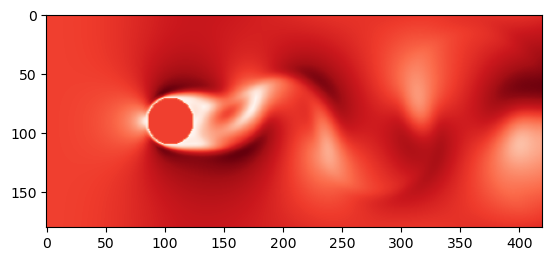

# cuda_d2q9_flow_over_cylinder
CUDA-accelerated 2d flow over cylinder simulation using d2q9 lattice

This is CUDA-accelerated version of code originally from the [Simulation and modeling of natural processes course on Coursera](https://www.coursera.org/learn/modeling-simulation-natural-processes/) . The original CPU implementation was adapted for GPU acceleration.

